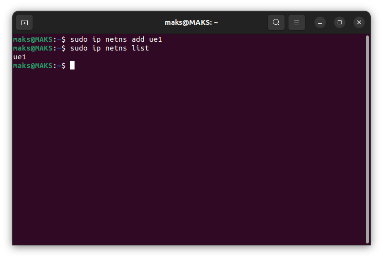
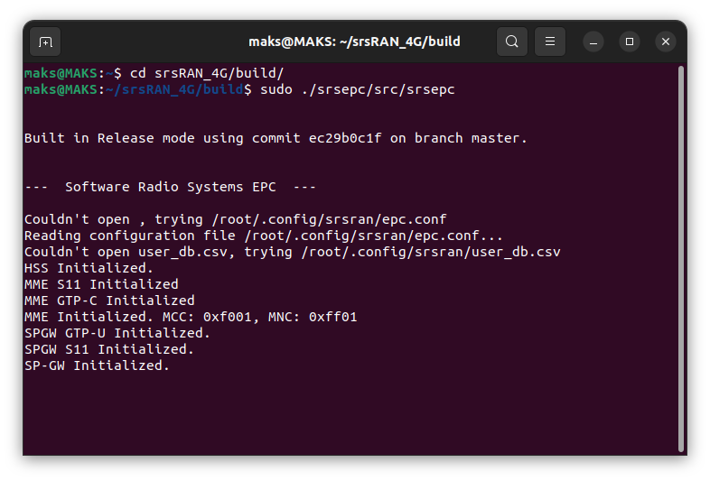
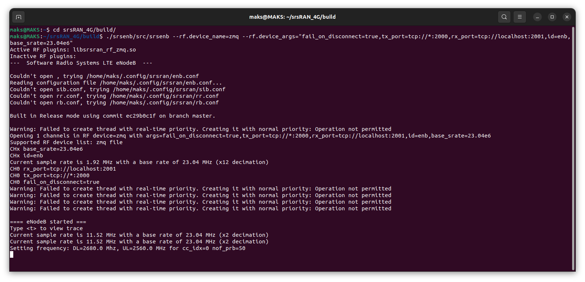
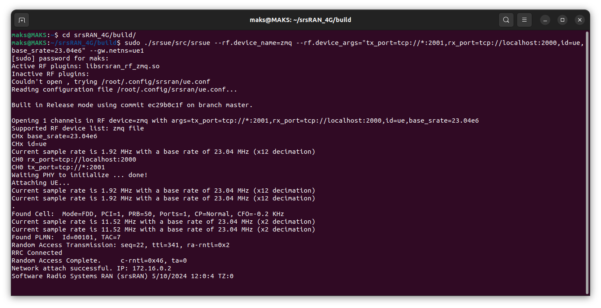
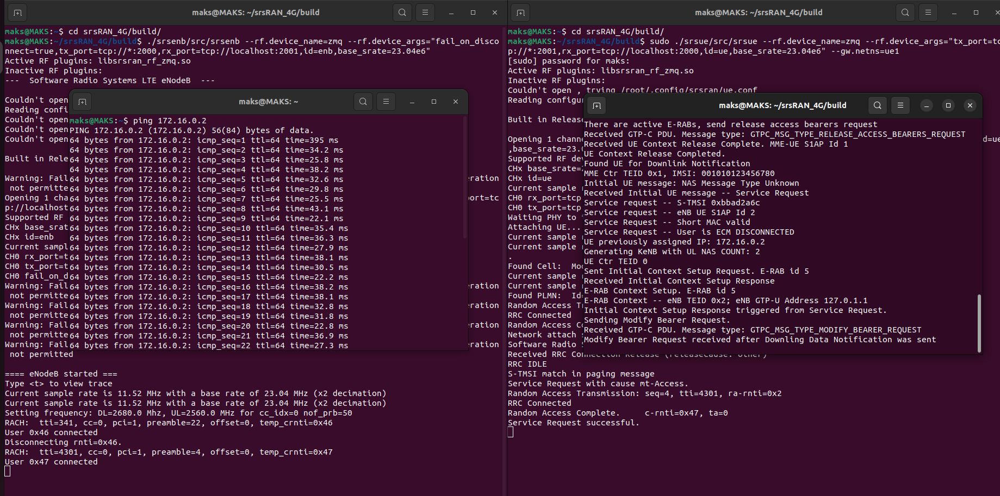
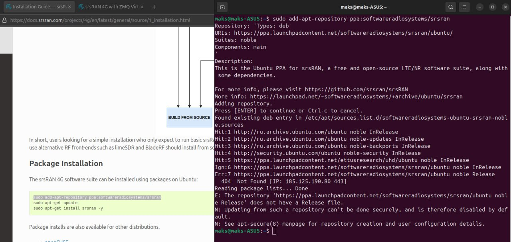

# Отчет на 27.09

### TLDR
1. Изучена докуменитация по началу работы с srsRAN 4G.
2. Собрал и запустил srsRAN 4G с корой, абонентом и eNodeB с импользованием сокетов ZMQ
3. Идет изучения статей по следующим моделям распространенния: 
    - [MMSE](https://www.sharetechnote.com/html/Communication_ChannelModel_MMSE.html)
    - Extended Pedestrian A (EPA)
    - Extended Vehicular A (EVA)
    - Extended Typical Urban (ETU)

    Ссылки на EPA\EVA\ETU
    - [mathworks](https://www.mathworks.com/help/lte/ug/propagation-channel-models.html)
    - [etsi](https://www.etsi.org/deliver/etsi_ts/136100_136199/136116/11.04.00_60/ts_136116v110400p.pdf)
    - [East West University](http://dspace.ewubd.edu:8080/bitstream/handle/123456789/2481/Suborna_Afrin.pdf?sequence=1&isAllowed=y)
    
4. В связи с возникшими проблемами было решено перейти с ubuntu 24.01 на ubuntu 22.04


---

## srsRAN 4G

<details><summary>Установка</summary>


<h2>Зависимости</h2>

<h3>ZeroMQ</h3>
<h4>1. Установка из репозиториев Ubuntu:</h4>
    
```bash
sudo apt-get install libzmq3-dev
```
<h4>2. Установка из исходного кода:</h4>
Клонирование репозитория libzmq:

```bash
git clone https://github.com/zeromq/libzmq.git
cd libzmq
```
Сборка и установка libzmq:
```bash
./autogen.sh
./configure
make
sudo make install
sudo ldconfig
```
Описание команды:

- **./autogen.sh:** генерирует файлы configure и Makefile, необходимые для сборки.
- **./configure:** проверяет наличие необходимых зависимостей и генерирует Makefile.
- **make:** компилирует библиотеку из исходного кода.
- **sudo make install:** устанавливает скомпилированную библиотеку в системные каталоги.
- **sudo ldconfig:** обновляет кеш библиотек, чтобы система могла найти установленную библиотеку libzmq.

Клонирование репозитория czmq:
```bash
git clone https://github.com/zeromq/czmq.git
cd czmq
```
Сборка и установка czmq:
```
./autogen.sh
./configure
make
sudo make install
sudo ldconfig
```

<h3>Установка необходимых библиотек</h3>

```bash
sudo apt-get install build-essential cmake libfftw3-dev libmbedtls-dev libboost-program-options-dev libconfig++-dev libsctp-dev
```
Описание команды:
 - **build-essential:** пакет, содержащий компилятор GCC/G++ и другие инструменты для сборки программ. 
 - **cmake:** инструмент для автоматизации сборки программного обеспечения из исходного кода.
 - **ibfftw3-dev:** библиотека для быстрого преобразования Фурье (FFT), используемая для обработки сигналов.
 - **ibmbedtls-dev:** библиотека с реализацией криптографических функций, используемая для обеспечения безопасности.
 - **libboost-program-options-dev:** библиотека для работы с параметрами командной строки, используемая для настройки srsRAN 4G.
 - **libconfig++-dev:** библиотека для работы с конфигурационными файлами, используемая для настройки srsRAN 4G.
 - **libsctp-dev:** библиотека для работы с протоколом SCTP, используемым для передачи данных между eNodeB и EPC.

 

<h2>srsRAN 4G</h2>

<h4>1. Установка из пакетов (Ubuntu)</h4>
Добавление PPA-репозитория:

```bash
sudo add-apt-repository ppa:softwareradiosystems/srsran 
```

Обновление списка пакетов:

```bash
sudo apt-get update 
```

Установка srsRAN:

```bash
sudo apt-get install srsran -y
```

<h4>2. Установка из исходного кода</h4>

Клонирование репозитория:
```bash
git clone https://github.com/srsRAN/srsRAN_4G.git
```

Создание директории сборки и переход в нее:

```bash
cd srsRAN_4G
mkdir build
```
Директория build/ создается для удобства, т.к. после сборки cmake\make будет созданно большое количество файлов.

Генерация и сборка проекта:
```bash
cd build
cmake ..
make
```

*Опционально*
```bash
make test
```
Запускаем набор тестов для проверки корректности сборки и работы srsRAN 4G.

Установка srsRAN 4G:
```bash
sudo make install
```
</details>

<details><summary>Запуск srsRAN 4G с помощью Zero MQ</summary>


Создание сетевого пространства имен для UE:

```bash
sudo ip netns add ue1
```
Проверка созданного сетевого пространства имен:
```bash
sudo ip netns list
```



### **[ВАЖНО!]Чтобы запустить EPC, eNB, UE необходимо открывать разные терминалы**

<h2>Запуск EPC</h2>

```bash
sudo ./srsepc/src/srsepc
```


<h2>Запуск eNodeB</h2>

```bash
./srsenb/src/srsenb --rf.device_name=zmq --rf device_args="fail_on_disconnect=true,tx_port=tcp://*:2000,rx_port=tcp://localhost:2001,id=enb,base_srate=23.04e6"
```
**Описание команды:** запускает eNodeB (srsenb) с использованием ZeroMQ. 
 - **-rf.device_name=zmq:** указывает на использование ZeroMQ в качестве радиомодуля.
 - **-rf.device_args:** задает параметры для ZeroMQ:
    - **fail_on_disconnect=true:** останавливает eNodeB при отключении UE.
    - **tx_port=tcp://*:2000:** порт для передачи данных (Tx) на UE.
    - **rx_port=tcp://localhost:2001:** порт для приема данных (Rx) от UE.
    - **id=enb:** идентификатор eNodeB.
    - **base_srate=23.04e6:** базовая частота дискретизации.

<h2>Запуск eNodeB</h2>

```bash
./srsenb/src/srsenb --rf.device_name=zmq --rf.device_args="fail_on_disconnect=true,tx_port=tcp://*:2000,rx_port=tcp://localhost:2001,id=enb,base_srate=23.04e6"
```



<h2>Запуск UE</h2>

```bash
sudo ./srsue/src/srsue --rf.device_name=zmq --rf.device_args="tx_port=tcp://*:2001,rx_port=tcp://localhost:2000,id=ue,base_srate=23.04e6" --gw.netns=ue1
```
**Описание команды:** запускает UE (srsue) от имени суперпользователя с использованием ZeroMQ.
- Параметры **--rf.device_name** и **--rf.device_args** те же, что в eNodeB, но с другими портами.
- **-gw.netns=ue1:** указывает на использование сетевого пространства имен ue1 для UE.



Обращаем внимание на следующую строку:
```bash
Network attach successful. IP: 172.16.0.2
```

Прописываем ping по данному адресу:
```bash
ping 172.16.0.2
```

В результате получаем следующее:




<h2>Удаление сетевого пространства имен</h2>

```bash
sudo ip netns delete ue1
```

<h3>Ресуры</h3>
https://docs.srsran.com/projects/4g/en/next/app_notes/source/zeromq/source/index.html
https://docs.srsran.com/projects/4g/en/latest/general/source/1_installation.html 
</details>

---

<details><summary>Изменение версии Ubuntu Linux</summary>

~~*В момент выяснения ошибок и их устранений не велась отчетность, по этому ход действий может быть нарушен*~~

При установке srsRAN 4G возникла следующая ошибка:



```bash
err:7 <>
404 Not Found [IP: 185.125.190.90 443]
```

Эта же ошибка возникала и при следующей команде:

```bash
sudo apt-get update
```

В поискахе решения данной проблемы наткнулся на [этот сайт](https://codereviewvideos.com/how-i-fixed-ubuntu-update-not-found-ip-185-125-190-36-80/)

Автор исправлял схожую проблему на Ubuntu 23.04. Он пришел к выводу, что ошибка была из-за файла sources.list

В Ubuntu 24.01 sources.list был изменен, разделен на несколько файлов

Способ изменения репозитория для зеркал в Ubuntu 24.01 был взят с [этого сайта](https://www.ubuntubuzz.com/2024/05/how-to-switch-repository-mirror-on-ubuntu-2404.html)

Перебрав множество стран и вариантов внутри этих стран; использования VPN(~~*не знаю зачем, но в тот момент казалось хорошей идеей*~~) проблема не исчезла.
Менялись: порядковый номер ошибки; ip-адрес; количество адресов, к которым нет возможности подключиться.

Спросив у знакомых: "Была ли у вас такая проблема и какая у вас версия Ubuntu?", было решено перейти на Ubuntu 22.04 LTS
</details>