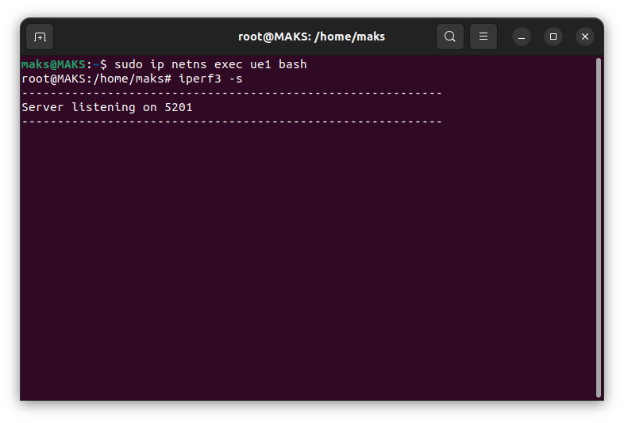
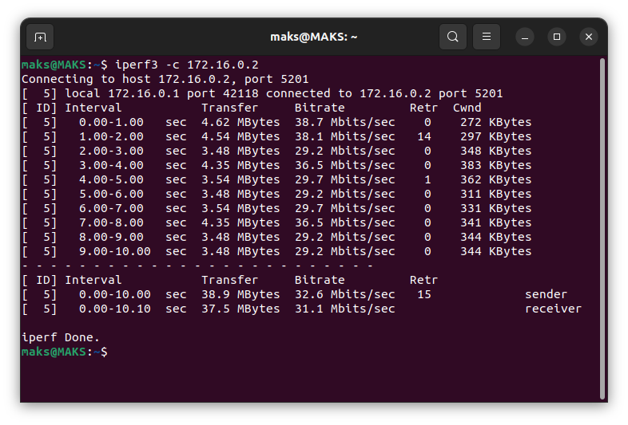
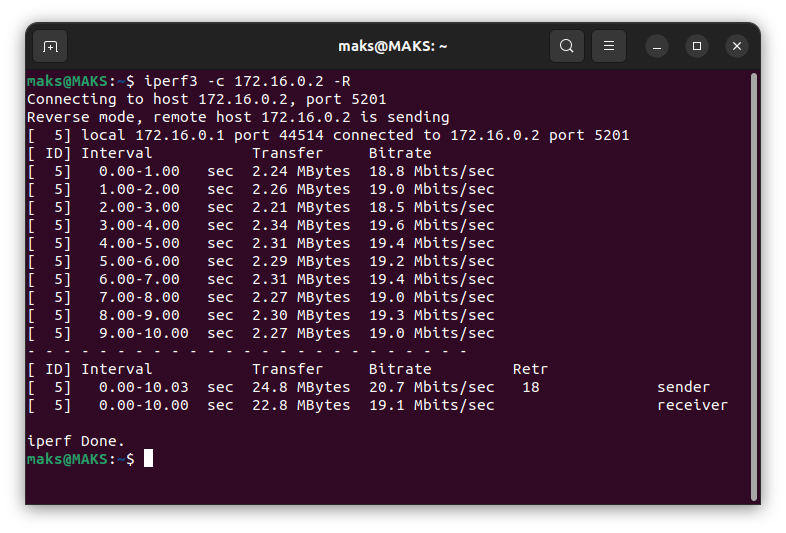
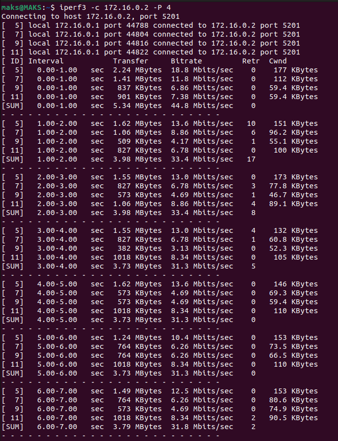
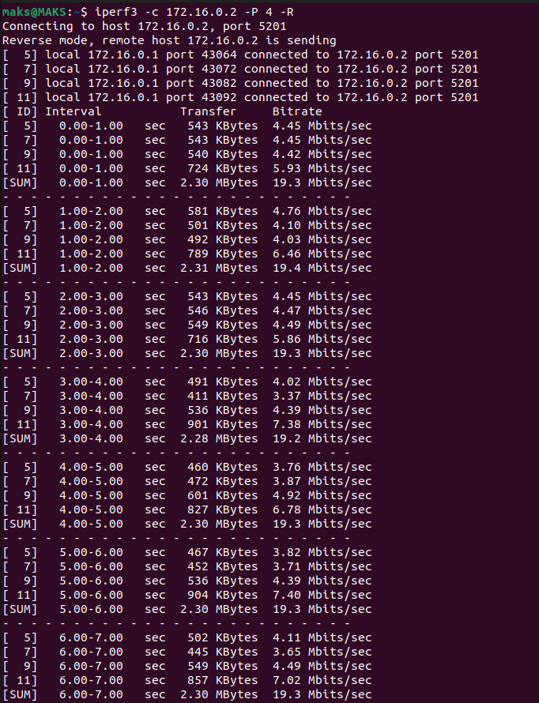
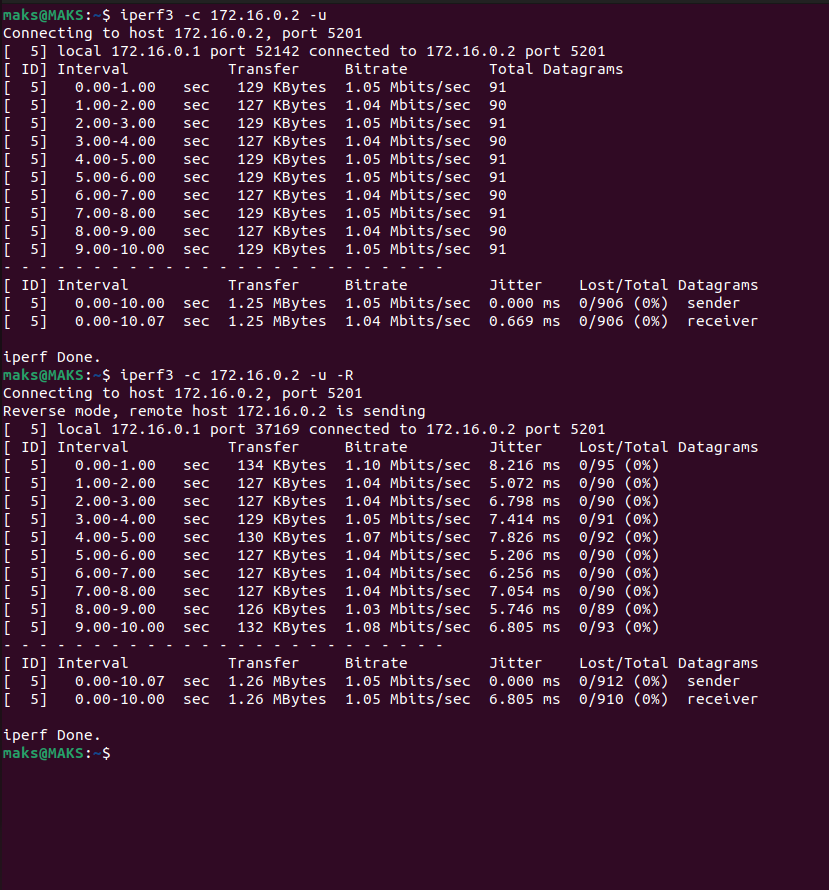

<h1>Throughput srsRAN 4G(ZeroMQ)</h1>


Iperf3 — кроссплатформенная консольная клиент-серверная программа — генератор TCP и UDP трафика для тестирования пропускной способности сети. С ее помощью довольно просто измерить максимальную пропускную способность сети между сервером и клиентом и провести нагрузочное тестирование канала связи.

Установка:

```bash
sudo apt-get install iperf3
```

Проверка:

```bash
iperf3 --version
```

<h2>Запуск srsRAN 4G</h2>

Запускаем симуляцию как было описанно в примере [27.09](../27.09/README.md) 

<h2>Использование Iperf3 в srsRAN 4G</h2>

<h4>Запуск iperf3 сервера на UE:</h4>

Открываем новый терминал и войдите в сетевое пространство имен ue1:

```bash
sudo ip netns exec ue1 bash
```

Запускаем iperf3 в режиме сервера:

```bash
iperf3 -s
```



<h4>Тэги iperf3</h4>

- **-u**: Использование UDP вместо TCP.
- **-R**: Изменение направления теста (измерение скорости uplink).
- **-w <размер>**: Установка размера буфера передачи.
- **t <время>**: Установка длительности теста в секундах.
- **P <число>:** Запуск нескольких параллельных потоков.

Измерим скорость downlink, то есть от хоста к UE. В этом режиме хост выступает как отправитель (sender) данных, а UE - как получатель (receiver)

Для этого в новом терминале выполните команду:

```bash
iperf3 -c <IP-адрес UE>
```



Данная таблица показывает как значения в конкретные моменты времени, так и среднее за все время работы(отделено пунктиром)


<h4>Средние значения downlink</h4>

- **Переданные данные:** 38.9 Mbits(sender) | 37.5 Mbits (receiver)
- **Скорость передачи:** 32.6 Mbits/sec(sender) | 31.1 Mbits/sec(receiver)


Измерим скорость uplink, то есть от UE к хосту. Опция -R включает реверсивный режим, при котором UE становится отправителем данных, а хост - получателем.

Для этого в терминале (вне ue1) выполните команду:

```bash
iperf3 -c <IP-адрес UE> -R
```




<h4>Средние значения uplink</h4>

- **Переданные данные:** 24.8 Mbits(sender) | 22.8 Mbits (receiver)
- **Скорость передачи:** 20.7 Mbits/sec(sender) | 19.1 Mbits/sec(receiver)

Попробуем многопоточность:

```bash
iperf3 -c <IP-адрес UE> -P 4
```

```bash
iperf3 -c <IP-адрес UE> -P 4 -R
```





Многопоточный тест показывает, как виртуальная сеть srsRAN 4G справляется с одновременной передачей данных в нескольких потоках.

В данном случае наблюдается незначительное увеличение суммарной пропускной способности при использовании 4 потоков.

Ну и запустим с флагом -u(использование UDP вместо TCP):

```bash
iperf -c  <IP-адрес UE> -u
```

```bash
iperf -c  <IP-адрес UE> -u
```



<h4>Средние значения downlink</h4>

- **Переданные данные:** 1.25 Mbits(sender) | 1.25 Mbits (receiver)
- **Скорость передачи:** 1.05 Mbits/sec(sender) | 1.04 Mbits/sec(receiver)

<h4>Средние значения uplink</h4>

- **Переданные данные:** 1.26 Mbits(sender) | 1.26 Mbits (receiver)
- **Скорость передачи:** 1.05 Mbits/sec(sender) | 1.05 Mbits/sec(receiver)
